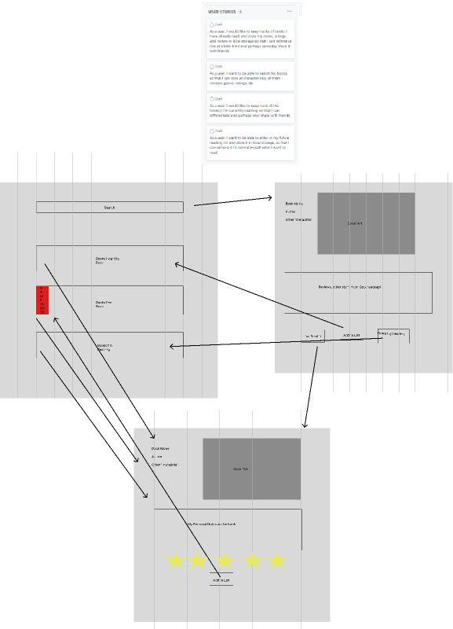

# cwru-project-one

Case Western Coding Bootcamp Group Project # 1

## Team Members
[Claudia Gillota](https://github.com/cgillota)
[Christopher Schmidt](https://github.com/cschmidt216)
[Trace Linton](https://github.com/Trace1983)

[Live Demo](https://codemodeactivate.github.io/book-it/)


## Description
This is our first bootcamp project in which we're required to use at least two APIs to make an interactive website that makes use of the user's local storage. We're also to use a CSS framework other than Bootstrap. We decided on Bulma because it had good documentation and positive reviews.

## To-Do
```
- [] TO DO LIST ITEM
```


## Future Development Ideas

## Notes


## Credits
[Inspiration for bookshelf implementation](https://www.codeply.com/go/bp/7h2JKXv40U)

## User Story

```md
AS A book reader
I WANT keep track of what I've read, am reading, or want to read
SO THAT I can stay organized and reflect and look back at notes
```

## Acceptance Criteria

```md

```

## Mock-Up

